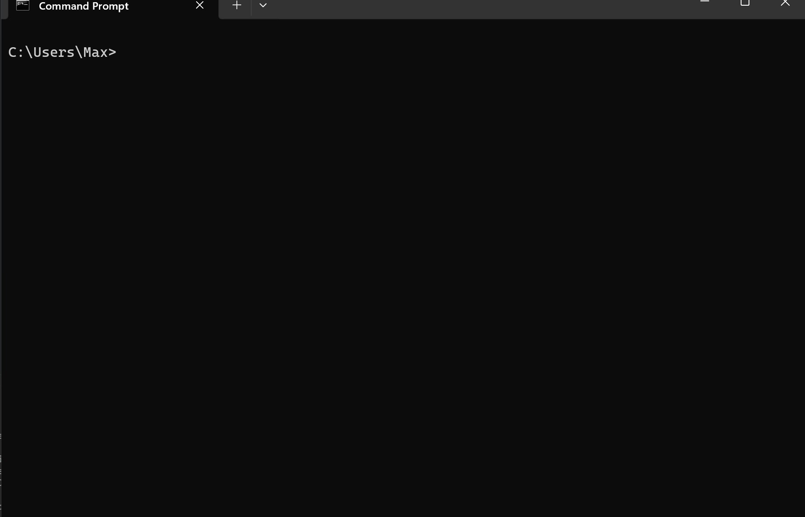

# gpt-cli

CLI to interact with OpenAIs ChatGPT model - `gpt-3.5-turbo`. The CLI does not retain memory. Every question to ChatGPT needs to be seen as an independent request.

## Prerequisite  

Add your OpenAI API key to the following env variable `OPENAI_API_KEY`.

## How to use? - Windows

1. clone this repo
2. build the CLI .exe via `cargo build --release`
3. add the CLI .exe path to your env variables
    - System Properties
    - Environment Variables...
    - System Variables
    - Path
    - Edit
    - New
    - add path to the `release` directory which contains the .exe
4. launch cmd or powershell and type: `gpt-cli` to activate the program
5. you can exit the program by typing `exit`

 

## References

  
Expand

   

Rust OpenAI Integration (GPT-3) - Code to the Moon: https://www.youtube.com/watch?v=5WhJQMnJjik&t=724s

