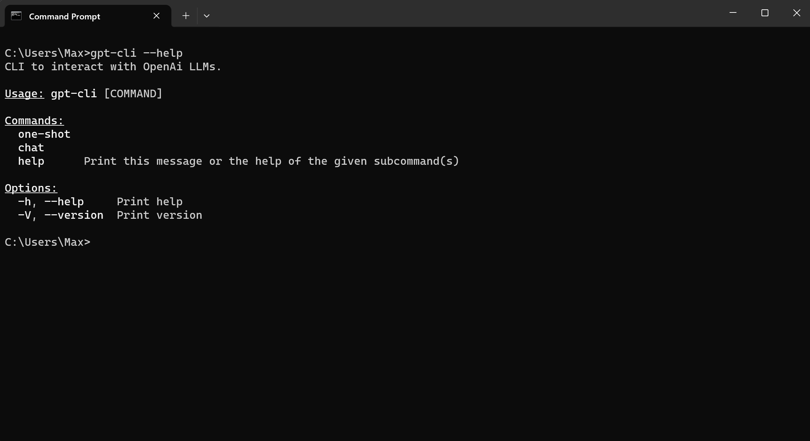
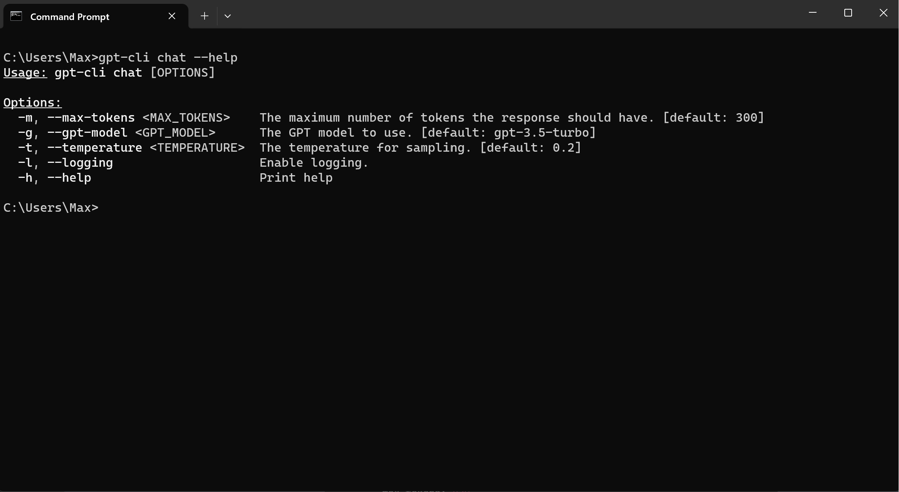
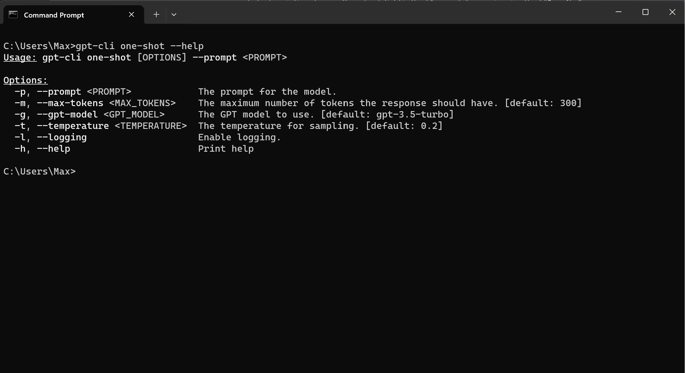

# `gpt-cli`

CLI to interact with OpenAIs ChatGPT models.

## Prerequisite  

Add your OpenAI API key to the following env variable `OPENAI_API_KEY`.

## Installation - Windows

1. clone this repo
2. build gpt-cli .exe via `cargo build --release`
3. add the gpt-cli .exe path to your env variables:
    - System Properties
    - Environment Variables...
    - System Variables
    - Path
    - Edit
    - New
    - add path to the `release` directory which contains the .exe

## Use

`gpt-cli` offers two modes:

1. `gpt-cli chat`
2. `gpt-cli one-shot`

### `gpt-cli chat`

This will launch `gpt-cli` in chat mode. Your GPT assistant will keep track of your conversation.

#### Commands within chat

##### `exit`

- will terminate the conversation

##### `clear`

- clears the whole chat history. The conversation will start from scratch.

##### `undo`

- will remove the last request and answer from the chat history.

#### Parameters

### `gpt-cli one-shot`

This will allow to perform a one prompt interaction. This mode exptects the `--prompt` (`-p`) flag.

#### Parameters

 

## References

  
Expand

   

Rust OpenAI Integration (GPT-3) - Code to the Moon: https://www.youtube.com/watch?v=5WhJQMnJjik&t=724s

